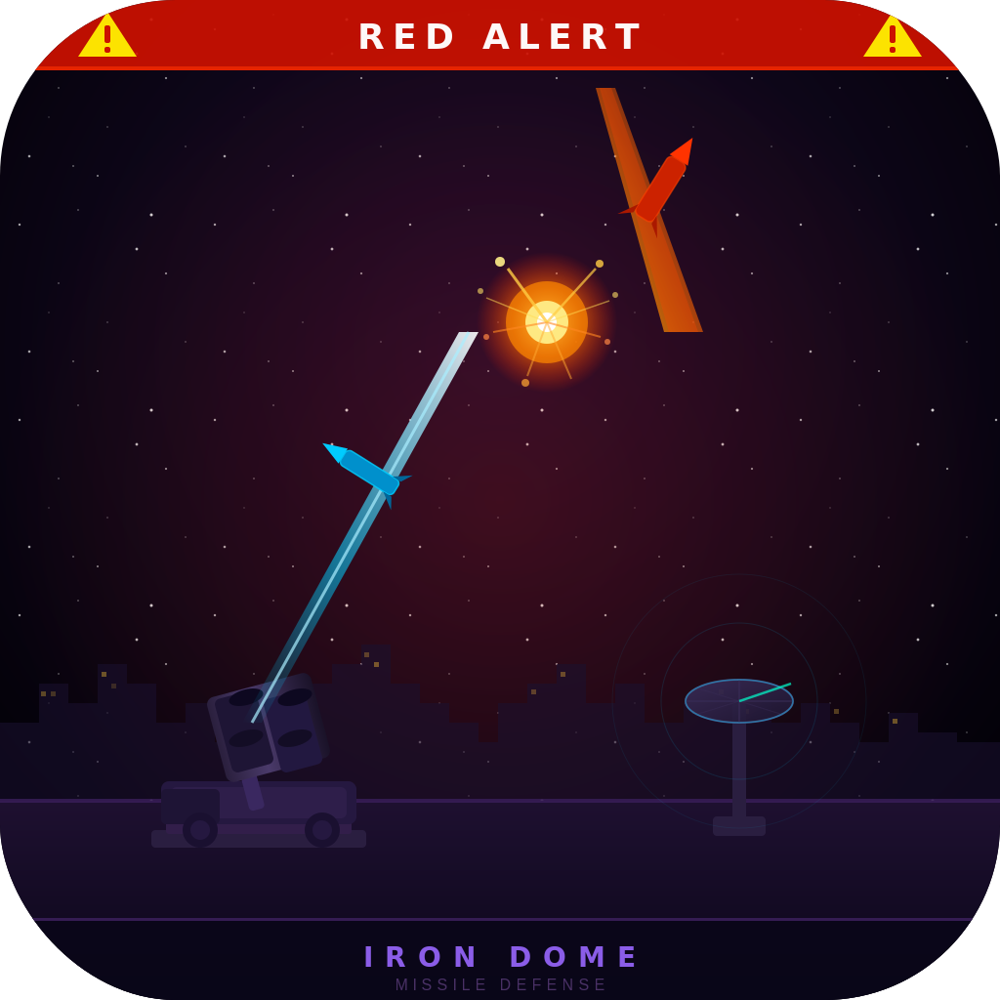

<p align="center">
  
</p>

# slack-red-alert

Updates your Slack status when a red alert (Tzeva Adom) fires in your area.

## How it works

Connects to the Tzofar WebSocket (`wss://ws.tzevaadom.co.il`) for real-time push alerts — no geo-restriction, no polling, works from anywhere.

When an alert matches your configured cities, a random status message is set on Slack. The status auto-clears 2 minutes after the last alert, with a 10-minute Slack-side expiry as a safety net.

## Setup

### 1. Create a Slack app

1. Go to https://api.slack.com/apps → **Create New App → From scratch**
2. Under **OAuth & Permissions**, add `users.profile:write` to **User Token Scopes**
3. Click **Install to Workspace** and copy the `xoxp-` token

### 2. Configure

```bash
cp .env.example .env

# Edit .env with your Slack token
```

### 3. Run

```bash
source .env && go run .
```

Or build and run:

```bash
go build -o slack-red-alert .
source .env && ./slack-red-alert
```

## Configuration

| Environment Variable | Required | Default | Description |
| --- | --- | --- | --- |
| `SLACK_TOKEN` | Yes | — | Slack user OAuth token (`xoxp-...`) |
| `ALERT_CITIES` | No | `תל אביב,גבעתיים,רמת גן` | Comma-separated city prefixes in Hebrew |
| `ALERT_STATUS_TEXTS` | No | 7 built-in messages | Pipe-separated status messages, random one picked per alert |
| `PORT` | No | `8080` | Health server port (set automatically by Render) |

### Default status messages

- Red Alert - seeking shelter
- BRB, dodging rockets
- In the safe room, back soon
- Taking cover - red alert
- Gone to the mamad, hold tight
- Rocket alert - be right back
- Currently sheltering in place

## Deploy to Render (free tier)

The app includes a built-in health server so it can run as a free Web Service on Render.

1. Push this repo to GitHub
2. Go to https://dashboard.render.com → **New → Web Service**
3. Connect your repo and configure:

| Field | Value |
| --- | --- |
| **Language** | Go |
| **Build Command** | `go build -tags netgo -ldflags '-s -w' -o app` |
| **Start Command** | `./app` |
| **Instance Type** | Free |

4. Add your env vars (`SLACK_TOKEN`, etc.) under **Environment**
5. Set up a free ping bot to prevent Render from sleeping the service after 15 minutes of inactivity:
   - Sign up at https://uptimerobot.com (free)
   - Add a new HTTP(s) monitor pointing to `https://your-app.onrender.com/health`
   - Set interval to 5 minutes

## Infrastructure note

This needs to run on an always-on machine — if your device sleeps, the process suspends and you'll miss alerts. Render's free tier with a ping bot (see above) is the easiest option.
